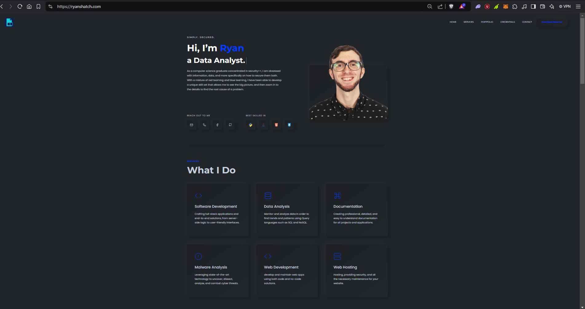
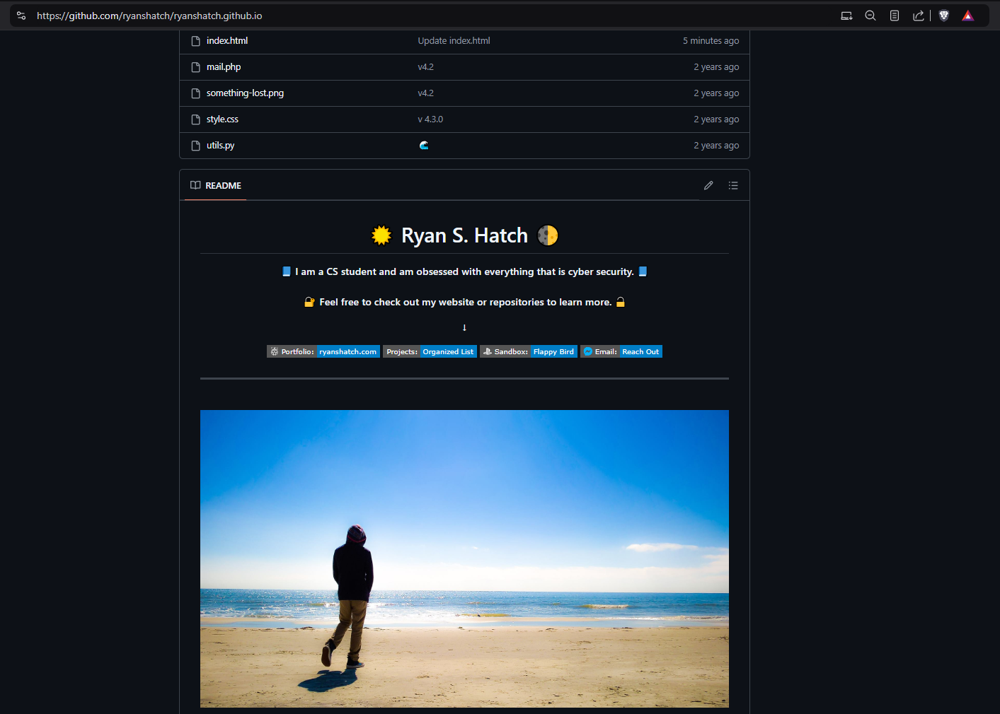

# ePortfolio in current state


Web Application


### _**ePortfolio** and **GitHub** Screen Shots:_

[**ePortfolio i: https://www.ryanshatch.com**](https://www.ryanshatch.com)

[**ePortfolio ii: https://www.github.com/ryanshatch/readme**](https://www.github.com/ryanshatch/readme)

### [AWS EC2 Instance: zencrypt.app](https://www.zencrypt.app)

<figure><figcaption>
website testing
</figcaption></figure>

<figure><figcaption>
EC2 instance
</figcaption></figure>

***

<figure><figcaption>
Ryanshatch
</figcaption></figure>

***
